# Java 17

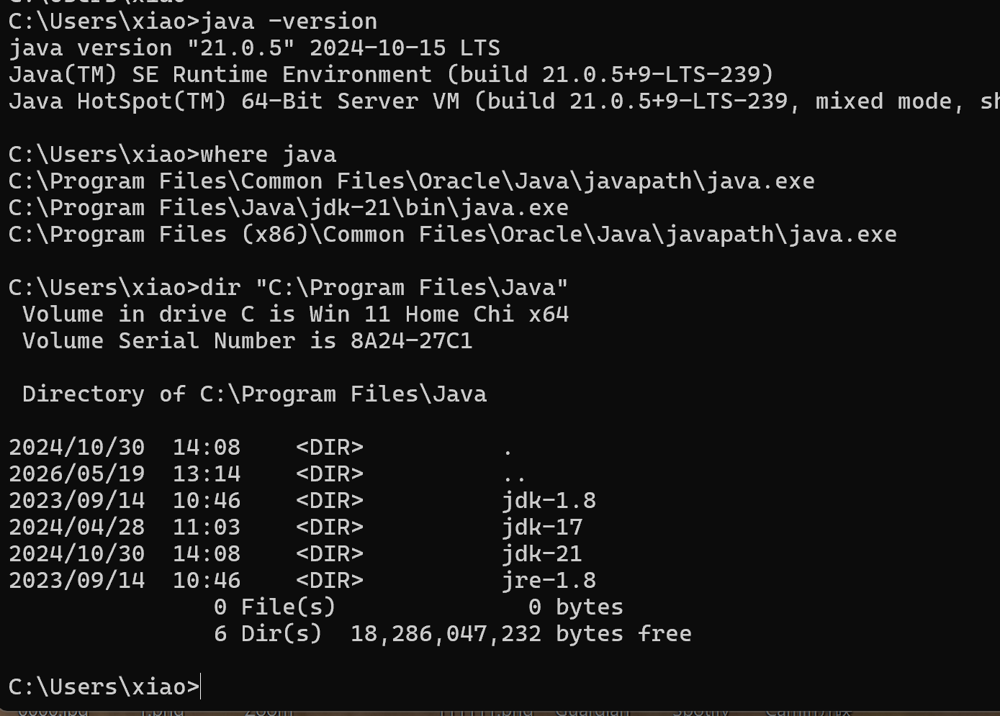

# Docker

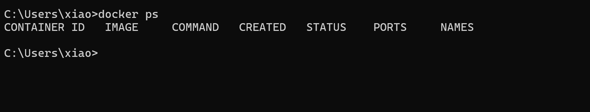

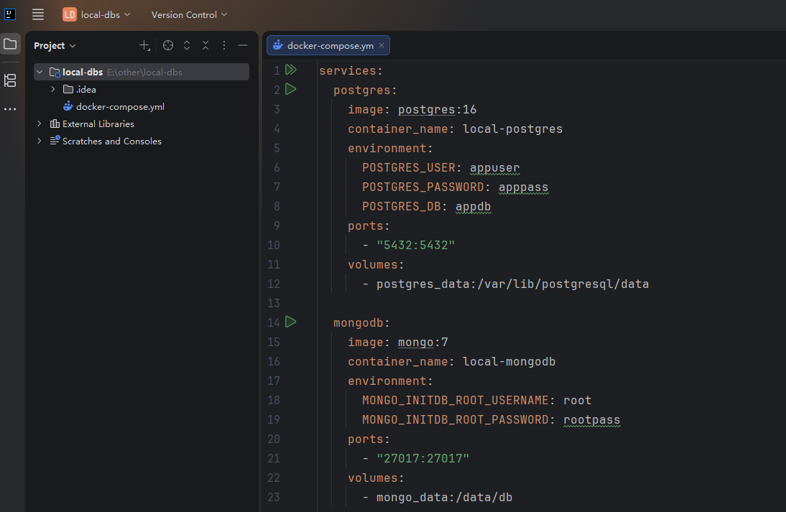

# Docker -DB

[ ] PostgreSQL (docker)
[ ] MongoDB (docker)
[ ] Redis (docker)
[ ] Cassandra (docker)
[ ] Elasticsearch  (docker)

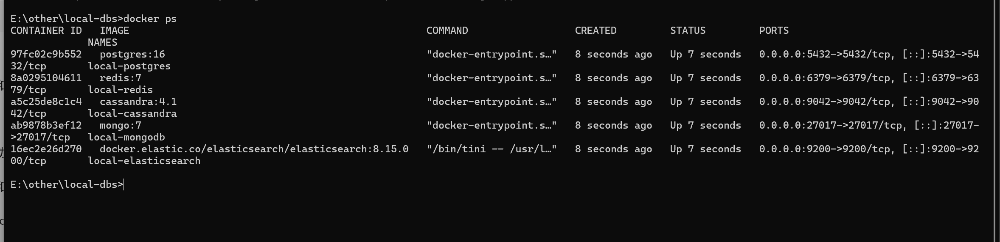

# Maven & Gradle

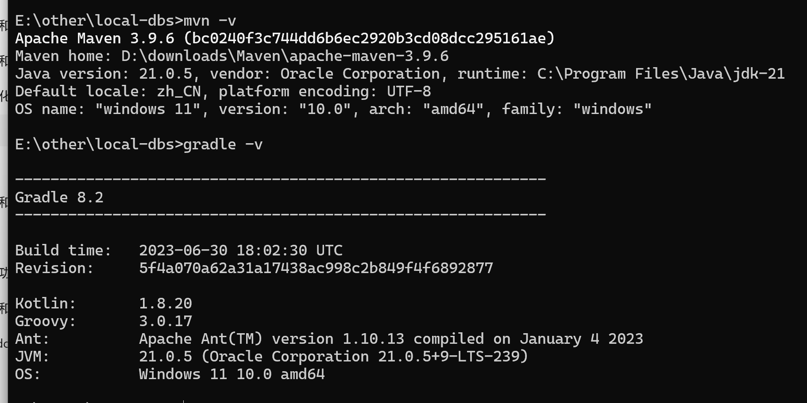

# AWS S3

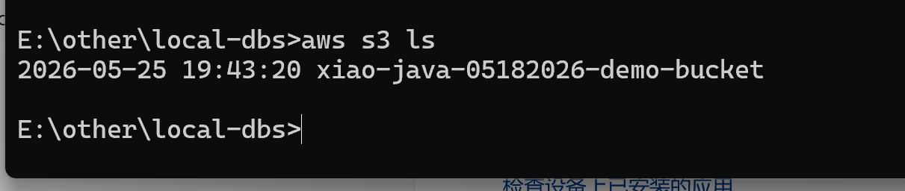

# Intellij

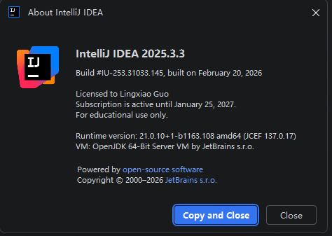

# git

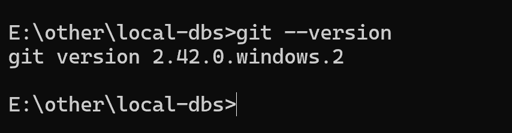

# OBS

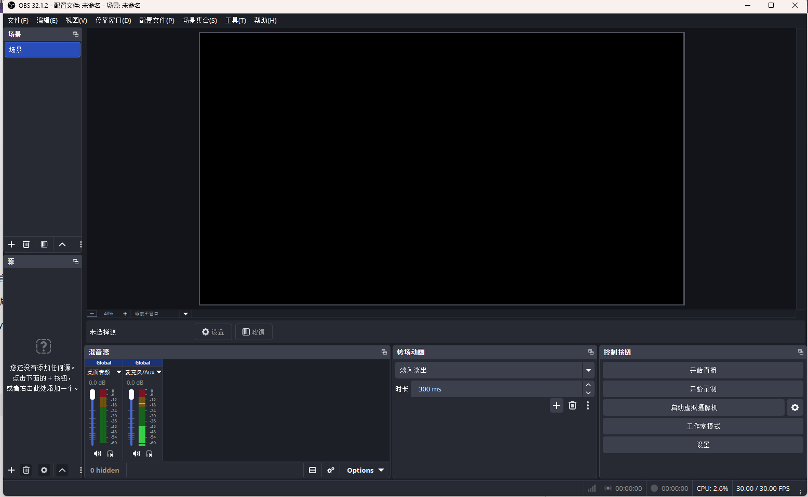

# Codex CLI

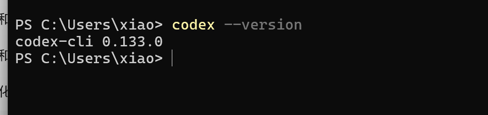

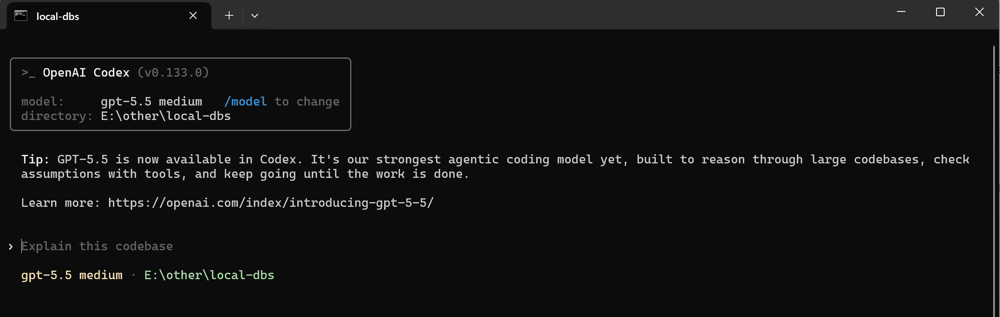

# LinkedIn

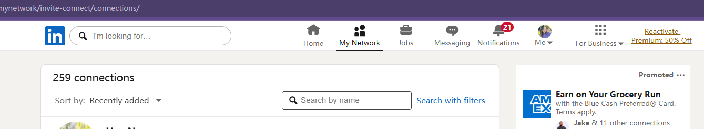
