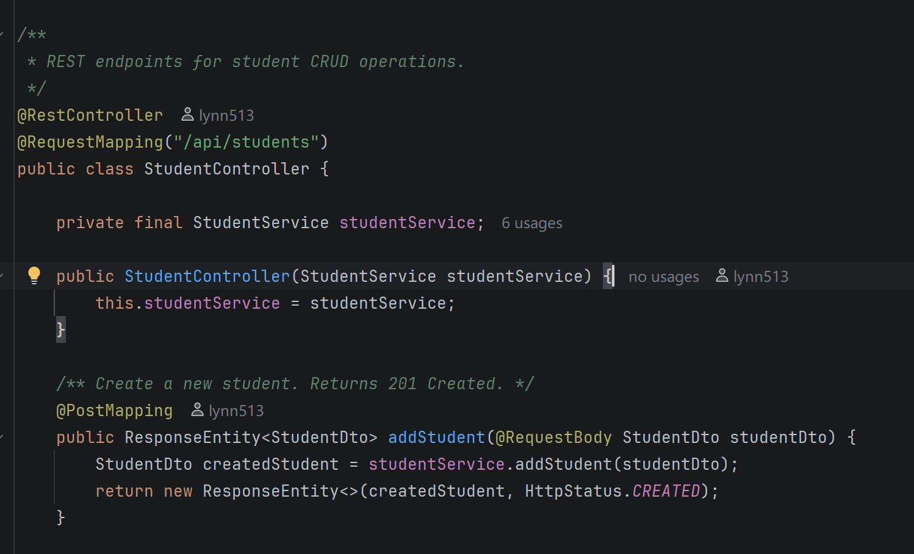

# what is Spring IOC

IoC means **Inversion of Control**. 

IoC is the idea that Spring controls object creation and dependency management instead of us doing it manually.

This helps make the code loosely coupled, easier to test, and easier to maintain. 

- It is easier to test because we can inject mock objects in unit tests.
- It is easier to maintain because if we replace one implementation with another, we do not need to change all the classes that depend on it. Spring can inject the new implementation for us.

DI is a way to achieve IoC, where Spring injects the needed dependencies into an object.

- Typical DI implementations include constructor injection, setter injection, and field injection.
- For example, we can annotate a service class with @Service, a repository with @Repository, and a controller with @RestController. These annotations tell Spring to create and manage these classes as beans.
- Then, if StudentController needs StudentService, we do not write new StudentService(). Instead, we define a constructor parameter, and Spring automatically finds the StudentService bean and injects it.

So the control of object creation is moved from our code to the Spring container.

# what is IOC Container

An **IoC container** is the core container in Spring that creates objects, manages their lifecycle, and injects dependencies for us.

In Spring, the main IoC containers are: `BeanFactory` and `ApplicationContext`

`BeanFactory` is the basic container. `ApplicationContext`  extends `BeanFactory` and provides more features.

By default, `BeanFactory` creates beans lazily. `ApplicationContext`creates singleton beans eagerly during application startup, so configuration problems can be found earlier.

# what is the advantage come with IOC

IOC helps make the code loosely coupled, easier to test, and easier to maintain. 

- It is easier to test because we can inject mock objects in unit tests.
- It is easier to maintain because if we replace one implementation with another, we do not need to change all the classes that depend on it. Spring can inject the new implementation for us.

# what is Dependency Injection (DI)

DI is a way to achieve IoC, where Spring injects the needed dependencies into an object.

- Typical DI implementations include constructor injection, setter injection, and field injection.
- For example, we can annotate a service class with @Service, a repository with @Repository, and a controller with @RestController. These annotations tell Spring to create and manage these classes as beans.
- Then, if StudentController needs StudentService, we do not write new StudentService(). Instead, we define a constructor parameter, and Spring automatically finds the StudentService bean and injects it.

So the control of object creation is moved from our code to the Spring container.

# write a demo code to show what is Dependency Injection (give screenshot)

This is constructor injection. The dependency is passed into the class through the constructor. It is preferred because the dependency is clearly required, it is easier to test with mocks, and the field can be final, so the dependency cannot be changed accidentally later.

# what are different types of Dependency Injection

Spring supports constructor injection, setter injection, and field injection, and constructor injection is usually preferred.

Constructor injection means passing dependencies into a class through its constructor. 

Field injection means we put `@Autowired` directly on a field. It makes unit testing harder, because we cannot easily pass mock dependencies into the object.

Setter injection means we put `@Autowired` on a setter method, and Spring calls this method to inject the dependency after the object is created.I

- It is useful for optional dependencies, but constructor injection is usually preferred for required dependencies.

# what are the pros and cons for each types of dependency Injection

For constructor injection, 

- the main advantage is that it makes required dependencies clear. The object cannot be created without its required dependencies, so it is safer. It also makes unit testing easier because we can pass mock dependencies directly when creating the object. Another advantage is that the fields can be final, which makes the object more stable.

- The disadvantage is that if a class has too many constructor parameters, the constructor becomes long. But this usually indicates that the class may have too many responsibilities and should be refactored.

For setter injection, 

- the advantage is that it is flexible. We can use it for optional dependencies, because the object can be created first and the dependency can be injected later.

- The disadvantage is that the object may be in an incomplete state if the setter is not called. Also, required dependencies are not as clear as constructor injection.

For field injection, 

- the advantage is that it is simple and requires less code.

- The disadvantage is that it hides the dependencies inside the class. It also makes unit testing harder because we cannot easily pass mock dependencies into the object. 

So in real Spring Boot projects, constructor injection is usually preferred for required dependencies, setter injection can be used for optional dependencies, and field injection is generally not recommended.

# @Component vs @Bean

`@Component` and `@Bean` are both used to register objects as Spring beans

`@Component` is used on a class. It tells Spring: “Please scan this class and create a bean for it.”

`@Bean` is used on a method inside a configuration class. It tells Spring: “Please call this method, and use the returned object as a bean.”

# what is @Configuration and @ComponentScan

@Configuration tells Spring: this class contains configuration.

`@ComponentScan` tells Spring: scan this package and find Spring beans automatically.

`@ComponentScan` is usually placed on a configuration class. It tells Spring to scan this package and find Spring beans automatically.

In Spring Boot, we usually do not write `@Configuration` and `@ComponentScan` manually every time, because `@SpringBootApplication` already includes them.

# @Controller vs @RestController

`@Controller` is usually used for traditional web applications that return pages, while `@RestController` is usually used for REST APIs that return data directly.

`@Controller` registers a class as a Spring MVC controller and also as a Spring bean.

In a `@Controller` class, the return value of each method is treated as a view name by default. Spring passes the view name to the `ViewResolver`, and the `ViewResolver` finds and renders the corresponding page.

`@RestController` is equivalent to `@Controller` plus `@ResponseBody`.

In methods defined in a `@RestController`, if a method returns a Java object, Spring serializes it into JSON and writes it directly to the HTTP response body.

@RestController 类中的每个方法，默认都会把返回值直接写入 HTTP 响应体

`@Controller` 类中的每个方法，默认会把返回值当作视图名，交给视图解析器去查找并渲染对应页面，而不是直接返回 JSON 或字符串数据。

# @Controller vs @Service vs @Repository

They all register a class as a Spring bean, but they are used for different layers.

`@Controller` tells Spring that this class is a controller bean. `Controller` handles HTTP requests from clients. `Controller` usually calls `Service`, instead of writing complex business logic itself.

`@Service` tells Spring that this class is a service bean.`Service` handles the core business logic.

`@Repository` tells Spring that this class is a repository bean.`Repository` is used to interact with the database.

# spring bean scope

There are 6 spring bean scopes: singleton, prototype, request, session, application, websocket

The most common scopes are `singleton` and `prototype`.

**singleton scope** means Spring creates only **one bean instance** for the whole Spring container, and that same instance is reused wherever it is injected. 

- By default, Spring beans are singleton scope. 

**prototype scope** means Spring creates a **new bean instance every time the bean is requested from the Spring container**.

- we can use `@Scope("prototype")` to make a bean prototype-scoped.

request scope means Spring creates **one bean instance for each HTTP request**.

session scope means Spring creates **one bean instance for each HTTP session**.

 application scope means Spring creates **one bean instance for the whole web application**.

websocket scope means Spring creates **one bean instance for each WebSocket session**.

# singleton vs prototype

`singleton` and `prototype` are two common Spring bean scopes.

In terms of **instance creation,** singleton means Spring creates only one instance in the IoC container. Prototype means Spring creates a new instance every time the bean is requested.

In terms of **lifecycle**, Spring fully manages the lifecycle of a singleton bean, from creation to destruction. For prototype beans, Spring mainly manages object creation. After the bean is created and returned, Spring does not fully manage its destruction.

In terms of **state,** singleton beans should be stateless, because the same instance may be used by many requests or many threads. Prototype beans are more suitable for stateful objects, because each usage can get a separate instance.

# give me 3 uses cases for each of singleton, prototype, request and session bean scope

Singleton is good for stateless, reusable components.

- Singleton beans examples are: Service layer beans, Repository layer beans, Utility or helper components like  Password encoder

prototype is good for stateful components

- For example, in an e-commerce system, a `CheckoutCalculationContext` may store selected items, discount rules, shipping fee, and tax calculation state for one checkout process. We do not want different users to share this temporary calculation state, so a new instance is safer.
- For example, a `RefundProcessingWorker` may handle one refund task. Each refund task should have its own worker instance, because different tasks should not affect each other.
- For example, an `OrderReportBuilder` may collect order data, user data, payment data, and shipping data, then generate one report. Each report generation should use a new builder instance, because the builder contains temporary intermediate data.

**Request scope** means Spring creates one bean instance for each HTTP request.

- user context, trace ID for request tracing, and request-level temporary cache

**Session scope** means Spring creates one bean instance for each HTTP session.

- For example, in an e-commerce system, a user may add products to the cart across multiple requests before checkout. The **shopping cart** should stay with the same user session.
- We can use session scope to store **user-specific preference**s during a session. For example, language, currency, theme, or region preference can be stored in the session. Then the user does not need to send the same preference in every request.
- We can also use session scope to store **recently viewed products** for one user during a session. For example, when a user views different product pages, the application can keep a list of recently viewed product IDs in the session. 

# session vs cookie

Session and cookie are both used to keep state in HTTP, because HTTP itself is stateless.

The main difference is: cookie stores data on the client side, while session stores data on the server side.

In terms of use cases, session and cookie can be used together, for example,  in a login flow, the cookie stores a `sessionId`, and the server uses this `sessionId` to find the session data. but we can also use cookies without sessions.  For example, cookies can store simple preferences like language, theme, and it can also store JWT token.

In terms of security,  if a cookie is not marked as `HttpOnly`, malicious JavaScript may read and steal it through XSS. Second, cookies are automatically sent with HTTP requests, so they can be vulnerable to CSRF if they are not protected by `SameSite`. Session is usually more secure because the actual data is stored on the server side. The browser only keeps a session ID. But the session ID still needs protection, because if someone steals the session ID, they may impersonate the user.

In terms of data size, Cookie has a size limit, usually around 4KB per cookie. So it is only suitable for small data. Session can store more data, because it is stored on the server side.

In terms of scalability, Cookie is stored on the client side, so it does not require server-side storage. Session requires server-side storage, so in distributed systems we need to handle session sharing, for example by storing sessions in Redis.

