# sql vs no sql database

In terms of the data model, SQL databases usually use structured tables with a predefined schema, while NoSQL databases support flexible models such as key-value, document, and wide-column models.

In terms of consistency, SQL databases usually provide strong ACID transactions. NoSQL databases often prioritize scalability and availability, but their consistency models depend on the specific database.

In terms of query capability, SQL is good at complex queries, aggregations, and joins. NoSQL is often optimized for specific and high-frequency access patterns.

In terms of scalability, traditional SQL databases mainly scale vertically, while NoSQL databases are usually designed for horizontal scaling. However, modern SQL databases can also scale horizontally.

In terms of performance, SQL is suitable for complex transactional workloads. NoSQL may provide better performance for certain high-concurrency read and write workloads.

In terms of schema changes, changing a SQL schema may require database migrations. NoSQL databases are usually more flexible when fields change, but the application must handle data consistency carefully.

SQL databases are commonly used for orders, payments, and account systems. NoSQL databases are commonly used for caching, logs, user sessions, and large-scale distributed data.

In real projects, SQL and NoSQL are often used together. For example, MySQL can store core business data, while Redis is used as a cache.


在数据模型方面，SQL 使用固定表结构，NoSQL 支持键值、文档、列族等灵活结构。

在事务一致性方面，SQL 通常支持完整的 ACID，NoSQL 更偏向高可用和最终一致性。

在查询能力方面，SQL 擅长复杂查询和多表关联，NoSQL 通常适合简单且高频的查询。

在扩展方式方面，SQL 传统上以垂直扩展为主，NoSQL 通常更容易进行水平扩展。

在性能方面，SQL 适合复杂业务处理，NoSQL 在特定高并发读写场景下性能更高。

在数据结构变化方面，SQL 修改 Schema 成本较高，NoSQL 对字段变化更灵活。

在适用场景方面，SQL 适合订单、支付和账户系统，NoSQL 适合缓存、日志和海量数据场景。

在实际使用方面，SQL 和 NoSQL 通常会结合使用，例如 MySQL 存核心数据，Redis 做缓存。

# what is database normalization

Database normalization is the process of organizing and splitting tables to reduce data redundancy and duplicate storage.

It helps prevent insertion, update, and deletion anomalies.

The First Normal Form requires each field to be atomic, which means it should contain only one value.

The Second Normal Form and Third Normal Form mainly eliminate partial dependencies and transitive dependencies.

However, over-normalization can require more joins, so real projects sometimes use denormalization to improve query performance.


1. Database normalization 是通过拆分表结构来减少数据冗余和重复存储。
2. 它可以避免插入、更新和删除数据时出现异常。
3. 第一范式要求字段保持原子性，不能存放多个值。
4. 第二范式和第三范式主要用于消除部分依赖和传递依赖。
5. 但过度规范化会增加表关联，因此实际项目中有时会适当反规范化来提升查询性能。


# vertical scaling vs horizontal

Vertical scaling means increasing the CPU, memory, or storage of a single server. Horizontal scaling means adding more server nodes.

In terms of implementation, vertical scaling usually requires fewer changes. Horizontal scaling often requires load balancing and a distributed architecture.

In terms of scalability limits, vertical scaling is limited by the maximum capacity of one machine. Horizontal scaling can continue by adding more nodes.

In terms of cost, high-performance hardware for vertical scaling can be expensive. Horizontal scaling can use multiple commodity servers.

In terms of availability, vertical scaling can create a single point of failure. Horizontal scaling makes it easier to achieve fault tolerance and high availability.

Vertical scaling is suitable for smaller systems or systems that are difficult to split. Horizontal scaling is more suitable for high-concurrency and large-scale distributed systems.


在扩展方式方面，Vertical Scaling 是提升单台服务器的 CPU、内存和磁盘，Horizontal Scaling 是增加服务器节点数量。

在实施难度方面，Vertical Scaling 改动较小，Horizontal Scaling 通常需要负载均衡和分布式架构。

在扩展上限方面，Vertical Scaling 受单机硬件限制，Horizontal Scaling 理论上可以持续增加节点。

在成本方面，Vertical Scaling 的高性能硬件通常更昂贵，Horizontal Scaling 可以使用多台普通服务器。

在可用性方面，Vertical Scaling 容易形成单点故障，Horizontal Scaling 更容易实现容错和高可用。

在适用场景方面，Vertical Scaling 适合规模较小或难以拆分的系统，Horizontal Scaling 适合高并发和大规模分布式系统。

# what is ACID

ACID represents four core properties that ensure reliable database transactions.

Atomicity means that all operations in a transaction either succeed together or are all rolled back.

Consistency means that the database must follow all business rules and constraints before and after a transaction.

Isolation means that concurrent transactions should not interfere with each other.

Durability means that once a transaction is committed, its data will not be lost, even if the system fails.


Atomicity（原子性）表示一个事务中的操作要么全部成功，要么全部回滚。

Consistency（一致性）表示事务执行前后，数据库都必须满足业务规则和约束。

Isolation（隔离性）表示多个事务并发执行时，彼此之间尽量互不影响。

Durability（持久性）表示事务一旦提交，数据即使在系统故障后也不会丢失。

ACID 是关系型数据库保证事务可靠性的四个核心特性。

# what is CAP

CAP stands for Consistency, Availability, and Partition Tolerance.

Consistency means that every read receives the latest data or an error.

Availability means that every request receives a response, but the response may not contain the latest data.

Partition Tolerance means that the system can continue operating when network communication between nodes is interrupted.

The CAP theorem states that during a network partition, a distributed system must choose between Consistency and Availability, such as CP systems like ZooKeeper or AP systems like Cassandra.


1. Consistency（一致性）表示所有节点在同一时刻看到的数据一致。
2. Availability（可用性）表示每个请求都能收到响应，但不保证返回的是最新数据。
3. Partition Tolerance（分区容错性）表示网络分区发生时，系统仍能继续运行。
4. CAP 定理指出，发生网络分区时，分布式系统只能在一致性和可用性之间选择一个。
5. 因此常见选择是 CP，例如 ZooKeeper，或 AP，例如 Cassandra。


# SQL Practice

## requirements

Use your PostgreSQL running in the local environment

Add a data source for PostgreSQL, connect to PostgreSQL, and then run a **default query console**. You can do all the homework there.

I recommend you get used to playing around with this console inside IntelliJ.

You must be able to understand what it does and be able to explain all those SQL statements—what does it do, and why do you do it?”

Create an MD file, and then upload all the SQL practice code to GitHub


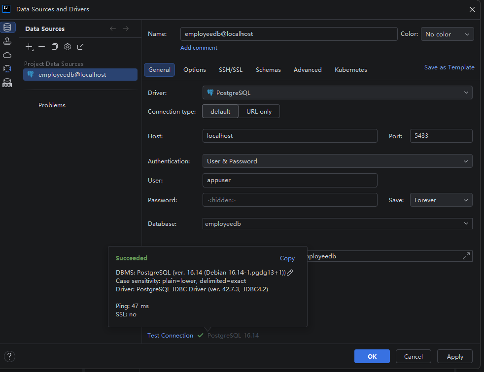

# Create Department Table & Employee Table   

1. create Employee(key, name, dept, age) and Department(key, name) Table

```sql
-- ========================================
-- 1. Create tables
-- ========================================

CREATE TABLE department
(
    department_id INTEGER PRIMARY KEY,
    name          VARCHAR(100) NOT NULL
);

CREATE TABLE employee
(
    employee_id   INTEGER PRIMARY KEY,
    name          VARCHAR(100)   NOT NULL,
    department_id INTEGER,
    age           INTEGER        NOT NULL,
    salary        NUMERIC(10, 2) NOT NULL,

    CONSTRAINT fk_employee_department
        FOREIGN KEY (department_id)
            REFERENCES department (department_id)
);
```

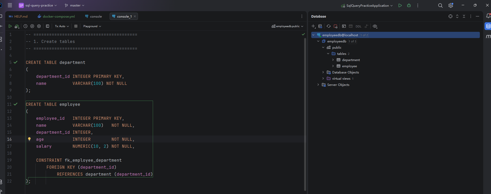

# insert some dummy data

```sql
-- ========================================
-- 2. Insert dummy data
-- ========================================

INSERT INTO department (department_id, name)
VALUES (1, 'Engineering'),
       (2, 'Marketing'),
       (3, 'Finance'),
       (4, 'Human Resources');


INSERT INTO employee (employee_id,
                      name,
                      department_id,
                      age,
                      salary)
VALUES (1, 'Alice', 1, 28, 75000),
       (2, 'Bob', 1, 35, 95000),
       (3, 'Charlie', 2, 32, 82000),
       (4, 'David', 3, 45, 120000),
       (5, 'Emma', 2, 26, 68000),
       (6, 'Frank', 3, 38, 100000),
       (7, 'Grace', 4, 31, 80000),
       (8, 'Henry', 1, 40, 110000);

```

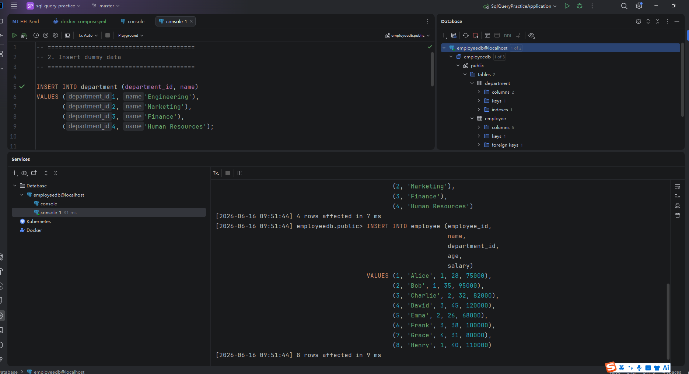


# query the data

## Get only employee names and ages.

```sql
-- ========================================
-- 1. Get only employee names and ages
-- ========================================

SELECT name, age
FROM employee;
```

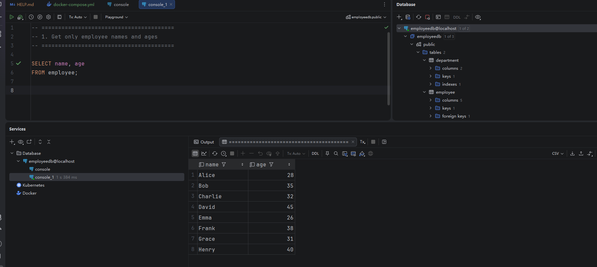


## Find employees older than 30

```sql
-- ========================================
-- 2. Find employees older than 30
-- ========================================

SELECT *
FROM employee
WHERE age > 30;
```

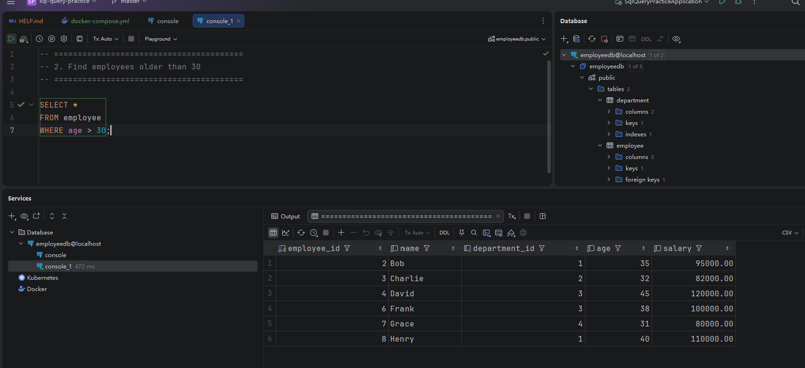


## Find employees whose salary is greater than 80,000

```sql
-- ========================================
-- 3. Find employees whose salary is greater than 80,000
-- ========================================

SELECT *
FROM employee
WHERE salary > 80000;


```

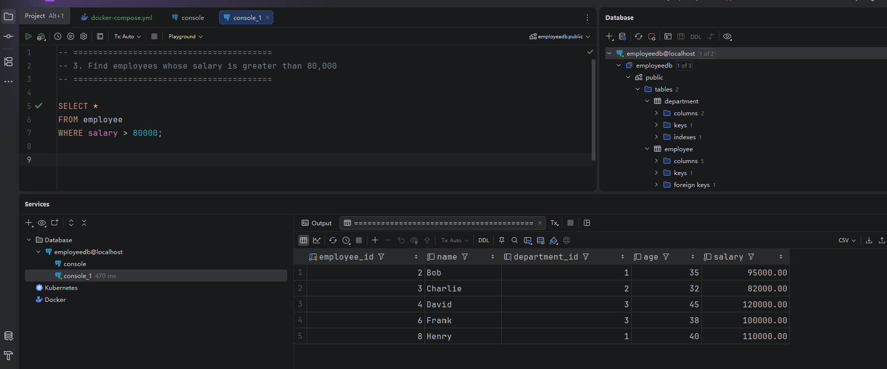

## List employees ordered by age (ascending)

```sql
-- ========================================
-- 4. List employees ordered by age ascending
-- ========================================

SELECT *
FROM employee
ORDER BY age ASC;
```

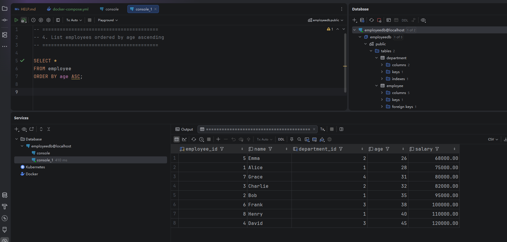

## Get the top 3 highest-paid employees

```sql
-- ========================================
-- 5. Get the top 3 highest-paid employees
-- ========================================

SELECT *
FROM employee
ORDER BY salary DESC
LIMIT 3;
```

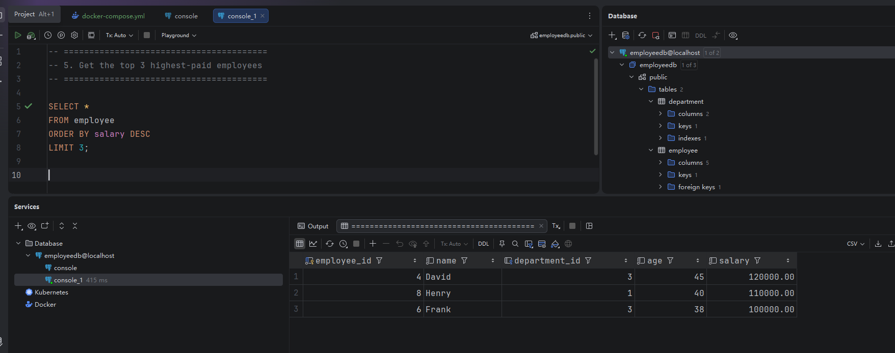

## Count total number of employees

```sql
-- ========================================
-- 6. Count the total number of employees
-- ========================================

SELECT COUNT(*) AS total_employees
FROM employee;
```

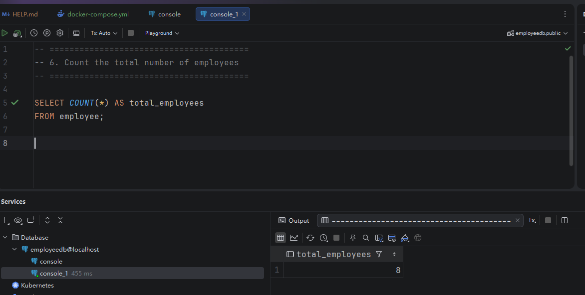

## Find the average salary of all employees

```sql
-- ========================================
-- 7. Find the average salary
-- ========================================

SELECT AVG(salary) AS average_salary
FROM employee;
```

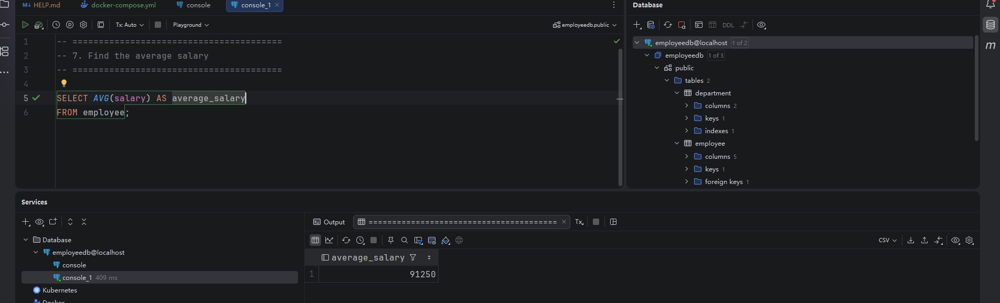

## List employee name with department name

```sql
-- ========================================
-- 8. List employee name with department name
-- ========================================

SELECT
    e.name AS employee_name,
    d.name AS department_name
FROM employee e
JOIN department d
    ON e.department_id = d.department_id;
```

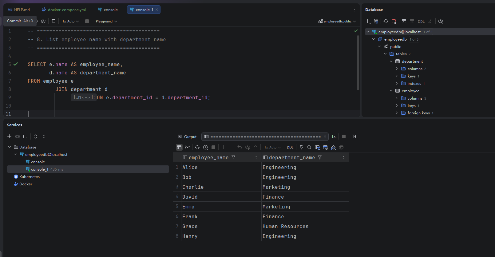

## Find employees earning the highest salary

```sql
-- ========================================
-- 9. Find employees earning the highest salary
-- ========================================

SELECT *
FROM employee
WHERE salary = (
    SELECT MAX(salary)
    FROM employee
);
```

不能这样写：

```sql
SELECT *
FROM employee
WHERE salary = MAX(salary);
```

因为 `WHERE` 是在聚合计算之前逐行过滤数据的，此时 `MAX(salary)` 还没有计算出来，所以 **aggregate function 不能直接这样放在 `WHERE` 中。**

因此需要分成两步：

```sql
-- 第一步：subquery 找出最高工资
SELECT MAX(salary)
FROM employee;
-- 第二步：outer query 找到工资等于最高工资的员工
SELECT *
FROM employee
WHERE salary = (
    SELECT MAX(salary)
    FROM employee
);
```


We use the subquery because `MAX(salary)` only returns the highest salary value. The outer query uses that value to find and return all employee records with the highest salary.

使用聚合函数时，如果 `SELECT` 里还要查询普通字段，那么这些普通字段必须出现在 `GROUP BY` 中。你这里没有使用 `GROUP BY`，所以不能同时查询其他员工字段。

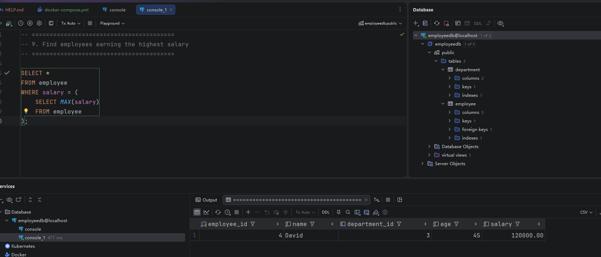

## Find employees earning the second highest salary

```sql
-- ========================================
-- 10. Find employees earning the second highest salary
-- ========================================

WITH ranked_employees AS (SELECT *,
                                 DENSE_RANK() OVER (ORDER BY salary DESC) AS salary_rank
                          FROM employee)
SELECT *
FROM ranked_employees
WHERE salary_rank = 2;
```

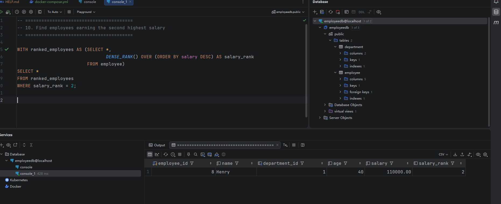

## Find employees earning the third highest salary

```sql
-- ========================================
-- 11. Find employees earning the third highest salary
-- ========================================

WITH ranked_employees AS (SELECT *,
                                 DENSE_RANK() OVER (ORDER BY salary DESC) AS salary_rank
                          FROM employee)
SELECT *
FROM ranked_employees
WHERE salary_rank = 3;
```

`WITH ranked_employees AS (...)` 创建了一个临时结果集，名字叫 `ranked_employees`。

`DENSE_RANK() OVER (ORDER BY salary DESC)` 按工资从高到低给员工排名。

工资相同的员工会得到相同的 `salary_rank`。

`DENSE_RANK()` 的排名不会跳号，所以最高、第二高和第三高工资对应的排名分别是 1、2 和 3。

最后的 `WHERE salary_rank = 3` 会返回所有工资属于第三高的员工。


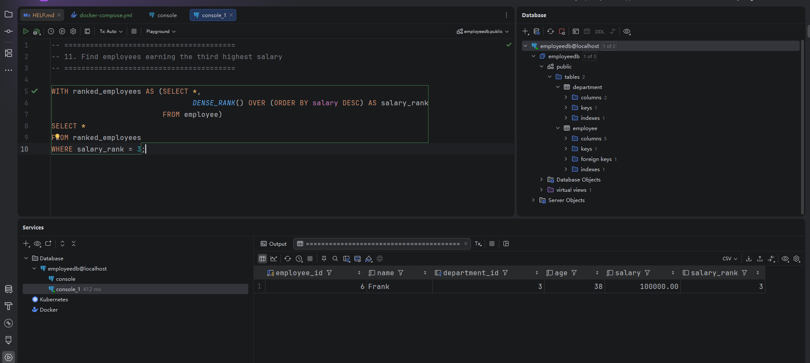