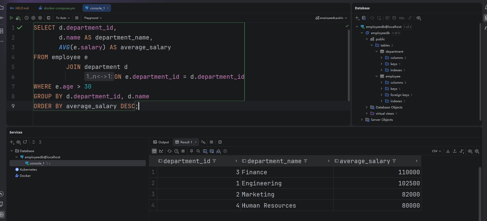
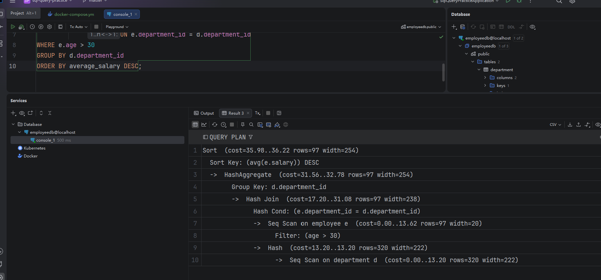

# what is index

An index is a database structure that helps find rows faster without scanning the entire table.

It is usually created on columns that are frequently used in `WHERE`, `JOIN`, `ORDER BY`, or `GROUP BY`.

Most relational databases use B-tree-based indexes, often implemented as B+ trees.

An index helps speed up data lookup, but it requires extra storage and makes `INSERT`, `UPDATE`, and `DELETE` operations slower because the index also needs to be updated. Therefore, we should create indexes only on useful columns, not on every column.


# clustered index vs nonclustered index

In terms of data storage, a clustered index determines the physical organization of the data rows, while a non-clustered index stores the index keys and row location information separately.

In terms of quantity, a table usually has only one clustered index, but it can have multiple non-clustered indexes.

In terms of query performance, clustered indexes are more suitable for range queries and sorting, while non-clustered indexes are better for fast lookups on specific columns.

In terms of row lookups, the leaf nodes of a clustered index usually store the complete data rows, while a non-clustered index may require an additional lookup when querying non-indexed columns.

In terms of write cost, page splits and data movement in a clustered index can be expensive. Too many non-clustered indexes also increase the cost of inserts, updates, and deletes.

In MySQL InnoDB, the primary key index is the clustered index. Secondary indexes are non-clustered indexes and use the primary key value to locate the data row.


在数据存储方面，聚簇索引决定数据行的物理组织顺序，非聚簇索引则单独存储索引键和数据定位信息。

在数量方面，一张表通常只能有一个聚簇索引，但可以有多个非聚簇索引。

在查询性能方面，聚簇索引更适合范围查询和排序，非聚簇索引更适合按特定字段快速查找。

在回表方面，聚簇索引的叶子节点通常直接保存完整数据行，非聚簇索引查询非索引列时可能需要回表。

在写入成本方面，聚簇索引发生页分裂或数据移动时开销通常更大，非聚簇索引过多也会增加插入、更新和删除成本。

在常见实现方面，MySQL InnoDB 的主键索引是聚簇索引，普通二级索引属于非聚簇索引，并通过主键值定位数据行。


# data structure for index

Most relational database indexes use a **B+ tree**.

A B+ tree keeps data balanced, so search, insert, and delete operations are usually `O(log n)`.

Its leaf nodes are ordered and linked, which makes it efficient for range queries, sorting, and prefix searches.

Some databases also support **hash indexes**, which are fast for exact-match queries but not suitable for range queries.

For low-cardinality columns in analytical systems, databases may also use **bitmap indexes**.


# view vs store procedure

In terms of purpose, a **view** is a virtual table based on a SQL query, while a **stored procedure** is a reusable program stored in the database.

In terms of usage, a view is queried like a table using `SELECT`, while a stored procedure is executed using `CALL` or `EXEC`.

In terms of logic, a view mainly contains a query, while a stored procedure can include parameters, variables, conditions, loops, and multiple SQL statements.

In terms of data modification, a view is mainly used for reading data, although some simple views can be updated. A stored procedure can perform inserts, updates, deletes, and complex business operations.

In terms of use cases, views are commonly used to simplify complex queries and control data access, while stored procedures are used to encapsulate reusable database logic and transactions.


**View（视图）**可以理解成“保存下来的查询结果结构”。它看起来像一张表，但通常不真正存储数据，数据还是来自原来的表。

比如你经常需要查询“员工姓名 + 部门名称”，可以把这个 JOIN 查询保存成一个 View。以后就可以像查普通表一样查询这个 View，不需要每次都重新写 JOIN。

**Stored Procedure（存储过程）**可以理解成“保存在数据库里的一个方法或程序”。它里面可以写多条 SQL，还可以接收参数，使用 `IF`、循环、事务等逻辑。

比如创建一个 `transfer_money` 存储过程，传入付款人、收款人和金额，它可以在一个事务中先扣款，再加款。

最简单的区别是：

- **View 是虚拟表，主要用来查询数据。**
- **Stored Procedure 是数据库中的一段可执行程序，用来完成一组操作。**


比如有一张订单表：

```sql
CREATE TABLE orders (
    id INT,
    user_id INT,
    amount DECIMAL(10, 2),
    status VARCHAR(20)
);
```

`View` 可以把“已支付订单”封装成一个虚拟表：

```sql
CREATE VIEW paid_orders AS
SELECT id, user_id, amount
FROM orders
WHERE status = 'PAID';
```

之后可以像查询普通表一样使用：

```sql
SELECT * FROM paid_orders;
```


`Stored Procedure` 可以封装一段带参数的业务操作，例如查询某个用户的已支付订单：

```sql
DELIMITER //

CREATE PROCEDURE get_paid_orders(IN uid INT)
BEGIN
    SELECT id, amount
    FROM orders
    WHERE user_id = uid
      AND status = 'PAID';
END //

DELIMITER ;
```

调用方式：

```sql
CALL get_paid_orders(1001);
```


# view vs material view

In terms of storage, a regular view stores only the query definition and does not store the query result, while a materialized view physically stores the query result.

In terms of query performance, a regular view executes the underlying SQL each time it is queried, while a materialized view reads the stored result and is usually faster.

In terms of data freshness, a regular view returns the latest data, while the data in a materialized view may be outdated.

In terms of refresh, a regular view does not need to be refreshed, while a materialized view needs to be refreshed manually, on a schedule, or incrementally.

In terms of storage cost, a regular view uses very little extra storage, while a materialized view requires additional disk space.

Simply put, a view is a saved query, while a materialized view is a saved query result.


在存储方面，普通 `View` 只保存查询定义，不保存查询结果；`Materialized View` 会把查询结果实际存储下来。
 在查询性能方面，普通 View 每次查询都会执行底层 SQL，物化视图直接读取已保存结果，通常更快。
 在数据实时性方面，普通 View 读取的是当前最新数据，物化视图的数据可能不是最新的。
 在刷新方面，普通 View 不需要刷新，物化视图需要手动、定时或增量刷新。
 在存储成本方面，普通 View 基本不占额外数据空间，物化视图需要额外磁盘空间。
 简单来说，`View` 是保存好的查询，`Materialized View` 是保存好的查询结果。


# how to tune the sql query

SQL tuning usually starts with `EXPLAIN` or the execution plan to check for full table scans, unused indexes, excessive table lookups, and temporary tables.

In terms of indexes, we should create appropriate indexes on frequently used columns in `WHERE`, `JOIN`, `ORDER BY`, and `GROUP BY` clauses. We can also use composite indexes to create covering queries when possible.

In terms of SQL syntax, we should avoid `SELECT *`, queries without proper conditions, functions on indexed columns, implicit type conversions, and `LIKE` patterns that start with `%`.

In terms of data access, we should reduce the number of scanned rows, select only the required columns, and control the data size through proper conditions, pagination, and batch processing.

In terms of joins, the joined columns should have compatible data types and proper indexes. We should also avoid unnecessary multi-table joins and Cartesian products between large tables.

In terms of sorting and grouping, we should let indexes handle sorting when possible and reduce filesorts, temporary tables, and `DISTINCT` operations on large datasets.

In terms of table design, we can use partitioning, sharding, read-write splitting, or appropriate denormalization based on the business requirements.


SQL 调优通常先用 `EXPLAIN` 或执行计划确认是否出现全表扫描、索引失效、回表过多和临时表。

在索引方面，应给 `WHERE`、`JOIN`、`ORDER BY` 和 `GROUP BY` 中高频使用的列建立合适索引，并尽量使用联合索引覆盖查询。

在 SQL 写法方面，应避免 `SELECT *`、无条件查询、对索引列做函数计算、隐式类型转换以及前缀为 `%` 的模糊查询。

在数据访问方面，应减少扫描行数，只查询需要的字段，并通过合理条件、分页和分批处理控制数据量。

在关联查询方面，应保证关联字段类型一致并有索引，避免不必要的多表 JOIN 和大表之间的笛卡尔积。

在排序和分组方面，应尽量让索引完成排序，减少 `filesort`、临时表和大数据量的 `DISTINCT`。

在表结构方面，可根据场景使用分区、分库分表、读写分离或适当反范式化。


# Saga vs 2PC 

Saga and 2PC are both used to maintain consistency in distributed transactions.

In terms of consistency, 2PC provides stronger consistency, while Saga usually provides eventual consistency through compensating transactions.

In terms of execution, 2PC has a prepare phase and a commit phase, while Saga splits a long transaction into multiple local transactions that run in sequence.

In terms of failure handling, 2PC rolls back the whole transaction when it fails, while Saga executes compensating actions to undo the completed steps.

In terms of performance, 2PC may hold database locks for a long time, so its performance and throughput are usually lower. Saga does not hold resources for a long time and usually performs better.

In terms of availability, 2PC depends on a coordinator and may cause blocking or a single point of failure, while Saga is more suitable for long-running workflows across multiple services.

In terms of use cases, 2PC is suitable for short transactions that require strong consistency, while Saga is suitable for microservice workflows such as orders, payments, and inventory.


Saga 和 2PC 都是用于解决分布式事务一致性问题的方案。

在一致性方面，2PC 追求强一致性，Saga 通常通过补偿事务实现最终一致性。

在执行方式方面，2PC 分为准备和提交两个阶段，Saga 将长事务拆成多个本地事务依次执行。

在失败处理方面，2PC 失败时统一回滚，Saga 失败时执行对应的补偿操作撤销之前的步骤。

在性能方面，2PC 需要长期持有数据库锁，性能和吞吐量较低；Saga 不长期锁资源，性能通常更好。

在可用性方面，2PC 依赖协调者，可能出现阻塞和单点问题；Saga 更适合跨服务、长流程的分布式系统。

在适用场景方面，2PC 适合事务时间短且要求强一致的场景，Saga 适合订单、支付、库存等微服务业务流程。

# SQL Practice

Find the average salary per department, only for employees older than30, ordered by average salary descending order. -> EXPLINA execution plan 



```sql
SELECT d.department_id,
       d.name        AS department_name,
       AVG(e.salary) AS average_salary
FROM employee e
         JOIN department d
              ON e.department_id = d.department_id
WHERE e.age > 30
GROUP BY d.department_id
ORDER BY average_salary DESC;
```

SELECT 用来定义查询结果中要显示的列 

- 原始列：`d.department_id`
- 修改列名：`d.name AS department_name`
- 计算结果：`AVG(e.salary) AS average_salary`
- 表达式：`salary * 12 AS annual_salary`

`SELECT` specifies which columns or calculated values will be included in the query result.


`GROUP BY d.department_id, d.name` 表示按照**部门 ID 和部门名称**对查询结果进行分组。

同一个部门的员工会被放到同一组


## EXPLAIN -  Execution Plan 

```sql
EXPLAIN
SELECT d.department_id,
       d.name        AS department_name,
       AVG(e.salary) AS average_salary
FROM employee e
         JOIN department d
              ON e.department_id = d.department_id
WHERE e.age > 30
GROUP BY d.department_id
ORDER BY average_salary DESC;
```



`EXPLAIN` **不会真正执行查询**，它只展示 PostgreSQL 预计采用的执行方式和估算成本。

这个 Execution Plan 一般从下往上

**逻辑执行顺序**一般是：

```
1. FROM
2. JOIN / ON
3. WHERE
4. GROUP BY
5. HAVING
6. SELECT
7. DISTINCT
8. ORDER BY
9. LIMIT / OFFSET
```

套到你的查询里就是：

```
1. 读取 employee 表
2. 根据 department_id 连接 department 表
3. 过滤出 age > 30 的员工
4. 按 department_id 分组
5. 计算每组的 AVG(salary)
6. 生成 SELECT 中指定的结果列
7. 按 average_salary 降序排序
```


1. 扫描 `department` 表

```
Seq Scan on department d
(cost=0.00..13.20 rows=320 width=222)
```

PostgreSQL 会顺序扫描整个 `department` 表。

- `Seq Scan`：逐行扫描整张表
- `rows=320`：预计会读取或返回 320 行，不是实际行数
- `width=222`：预计每行平均占 222 字节
- `cost=0.00..13.20`：优化器估算的启动成本和总成本，不是毫秒

你的表只有 4 行，所以使用 `Seq Scan` 很正常，没必要使用索引。


